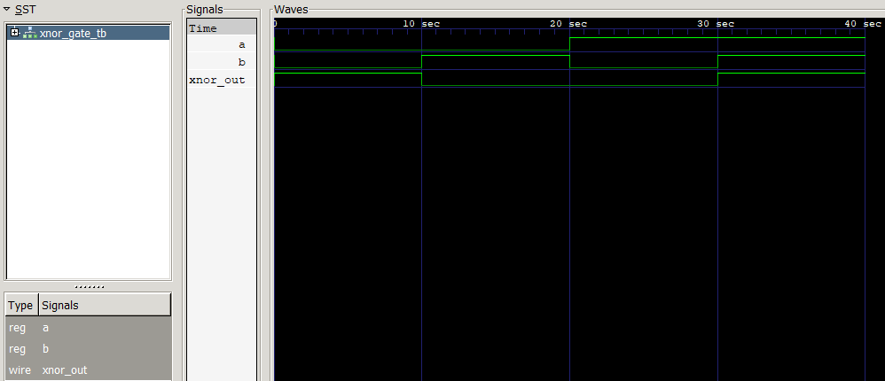

# Digital Design Learning Repository

Welcome to my comprehensive Digital Design learning journey! This repository documents my exploration of digital systems, hardware description languages, and low-level programming concepts.


## Featured Projects: Verilog Logic Gates

### AND Gate Module and Testbench
This project demonstrates a simple 2-input AND gate written in Verilog, along with its testbench and waveform output.

- **Source:** [`verilog/basics/and_gate.v`](verilog/basics/and_gate.v)
- **Testbench:** [`verilog/basics/and_gate_tb.v`](verilog/basics/and_gate_tb.v)
- **Waveform Screenshot:**


The waveform shows the expected truth table for an AND gate:

| a | b | y (a & b) |
|---|---|-----------|
| 0 | 0 |     0     |
| 0 | 1 |     0     |
| 1 | 0 |     0     |
| 1 | 1 |     1     |

---

### OR Gate Module and Testbench
This project demonstrates a simple 2-input OR gate written in Verilog, along with its testbench and waveform output.

- **Source:** [`verilog/basics/or_gate.v`](verilog/basics/or_gate.v)
- **Testbench:** [`verilog/basics/or_gate_tb.v`](verilog/basics/or_gate_tb.v)
- **Waveform Screenshot:**


The waveform shows the expected truth table for an OR gate:

| a | b | y (a &#124; b) |
|---|---|-------------|
| 0 | 0 |     0       |
| 0 | 1 |     1       |
| 1 | 0 |     1       |
| 1 | 1 |     1       |

---

### NOT Gate Module and Testbench
This project demonstrates a simple NOT gate (inverter) written in Verilog, along with its testbench and waveform output.

- **Source:** [`verilog/basics/not_gate.v`](verilog/basics/not_gate.v)
- **Testbench:** [`verilog/basics/not_gate_tb.v`](verilog/basics/not_gate_tb.v)
- **Waveform Screenshot:**


The waveform shows the expected truth table for a NOT gate:

| a | y (~a) |
|---|--------|
| 0 |   1    |
| 1 |   0    |

---

### XOR Gate Module and Testbench
This project demonstrates a simple 2-input XOR gate written in Verilog, along with its testbench and waveform output.

- **Source:** [`verilog/basics/xor_gate.v`](verilog/basics/xor_gate.v)
- **Testbench:** [`verilog/basics/xor_gate_tb.v`](verilog/basics/xor_gate_tb.v)
- **Waveform Screenshot:**


The waveform shows the expected truth table for a XOR gate:

| a | b | y (a ^ b) |
|---|---|-----------|
| 0 | 0 |     0     |
| 0 | 1 |     1     |
| 1 | 0 |     1     |
| 1 | 1 |     0     |

---

### XNOR Gate Module and Testbench
This project demonstrates a simple 2-input XNOR gate written in Verilog, along with its testbench and waveform output.

- **Source:** [`verilog/basics/xnor_gate.v`](verilog/basics/xnor_gate.v)
- **Testbench:** [`verilog/basics/xnor_gate_tb.v`](verilog/basics/xnor_gate_tb.v)
- **Waveform Screenshot:**



The waveform shows the expected truth table for a XNOR gate:

| a | b | y (a ~^ b) |
|---|---|------------|
| 0 | 0 |     1      |
| 0 | 1 |     0      |
| 1 | 0 |     0      |
| 1 | 1 |     1      |

---

### NOR Gate Module and Testbench
This project demonstrates a simple 2-input NOR gate written in Verilog, along with its testbench and waveform output.

- **Source:** [`verilog/basics/nor_gate.v`](verilog/basics/nor_gate.v)
- **Testbench:** [`verilog/basics/nor_gate_tb.v`](verilog/basics/nor_gate_tb.v)
- **Waveform Screenshot:**


The waveform shows the expected truth table for a NOR gate:

| a | b | y ~(a &#124; b) |
|---|---|---------------|
| 0 | 0 |      1        |
| 0 | 1 |      0        |
| 1 | 0 |      0        |
| 1 | 1 |      0        |

---

## 📚 What's Inside

This repository serves as a knowledge base and practical workspace for:

- **Digital Design Fundamentals** - Logic gates, combinational & sequential circuits
- **C Programming** - Low-level programming, embedded systems, and hardware interfacing
- **Verilog HDL** - Hardware description and digital system modeling

---

## 🗂️ Repository Structure

```
DigitalDesign/
├── 📁 digital-design/          # Digital design theory and projects
│   ├── 📁 combinational/       # Combinational logic circuits
│   ├── 📁 sequential/          # Sequential logic & state machines
│   ├── 📁 memory/              # Memory systems and storage
│   └── 📁 processors/          # CPU design and architecture
├── 📁 c-programming/           # C language learning and projects
│   ├── 📁 basics/              # Fundamentals and syntax
│   ├── 📁 embedded/            # Embedded C programming
│   ├── 📁 hardware-interface/  # Hardware communication
│   └── 📁 projects/            # Practical implementations
├── 📁 verilog/                 # Verilog HDL code and designs
│   ├── 📁 basics/              # Basic Verilog concepts and gates
│   ├── 📁 modules/             # Reusable Verilog modules
│   ├── 📁 testbenches/         # Simulation and testing
│   └── 📁 fpga-projects/       # FPGA implementation projects
├── 📁 images/                  # Simulation screenshots and diagrams
└── 📄 README.md                # Main documentation
```

---

## 🎯 Learning Objectives

### Digital Design
- [ ] Boolean algebra and logic minimization
- [ ] Combinational circuit design (multiplexers, decoders, encoders)
- [ ] Sequential circuit design (flip-flops, counters, registers)
- [ ] State machine design and implementation
- [ ] Memory systems (RAM, ROM, cache)
- [ ] Computer architecture fundamentals
- [ ] Timing analysis and clock domains

### C Programming
- [ ] C fundamentals and syntax
- [ ] Pointers and memory management
- [ ] Bit manipulation and bitwise operations
- [ ] Embedded C programming
- [ ] Hardware register manipulation
- [ ] Interrupt handling
- [ ] Real-time programming concepts

### Verilog HDL
- [ ] Verilog syntax and modeling styles
- [ ] Behavioral vs. structural modeling
- [ ] Combinational and sequential logic in Verilog
- [ ] Testbench development
- [ ] Synthesis considerations
- [ ] FPGA implementation
- [ ] Timing constraints and analysis

---

## 🛠️ Tools & Environment

### Software Tools
- **Text Editor/IDE**: VS Code with Verilog extensions
- **C Compiler**: GCC/MinGW for Windows
- **Verilog Simulator**: ModelSim, Vivado, or open-source alternatives
- **FPGA Tools**: Xilinx Vivado, Intel Quartus, or Lattice Diamond
- **Version Control**: Git

### Hardware Platforms
- Development boards (Arduino, FPGA boards)
- Logic analyzers and oscilloscopes
- Breadboards and basic electronic components

---

## 📖 Key Resources

### Books
- "Digital Design and Computer Architecture" by Harris & Harris
- "The C Programming Language" by Kernighan & Ritchie
- "Verilog HDL: A Guide to Digital Design and Synthesis" by Palnitkar

### Online Resources
- [Nandland](https://www.nandland.com/) - FPGA and Verilog tutorials
- [HDLBits](https://hdlbits.01xz.net/) - Verilog practice problems
- [Ben Eater's YouTube Channel](https://www.youtube.com/c/BenEater) - Digital logic explanations

### Documentation
- IEEE 1364 Verilog Standard
- C11 Standard (ISO/IEC 9899:2011)
- FPGA vendor documentation

---

## 🚀 Getting Started

### Current Workflow
**Learning Phase**: Create files anywhere in the repository as you learn and experiment. Don't worry about perfect organization initially - focus on understanding concepts and building things!

**Organization Phase**: Later, we'll sort and move files into the structured folders shown above based on what you've learned and created.

### For C Programming
```powershell
# Compile and run a C program (Windows PowerShell)
gcc -o program.exe program.c
.\program.exe
```

### For Verilog Development
```powershell
# Basic Verilog compilation (using Icarus Verilog)
iverilog -o simulation.vvp module.v testbench.v
vvp simulation.vvp
```

### Setting Up the Environment
1. Clone or download this repository
2. Install required tools (GCC/MinGW, Verilog simulator)
3. Configure your development environment
4. Start creating files and learning - organization comes later!

---

## 📝 Progress Tracking

### File Organization Strategy
📋 **Current Approach**: Files are created in the root directory during active learning
🗂️ **Future Organization**: Files will be moved to appropriate folders in the structure above
📂 **Temp Files**: Keep experimenting! We'll sort everything later

### Recent Updates
- **Aug 17, 2025** - Added NOR, XNOR, XOR, NOT, OR, AND gate Verilog projects and updated documentation
- **Aug 7, 2025** - Initial repository setup and README creation

### Current Focus
- [ ] Learning area currently being studied
- [ ] Specific project or concept being implemented
- [ ] Next milestone or goal

### Files to Organize Later
*This section will track files that need to be moved to proper folders:*
- [ ] List of files created during learning sessions
- [ ] Notes on which folder each file should go to
- [ ] Any files that need renaming or restructuring

---

## 🤝 Contributing to This Repository

This is a personal learning repository, but if you find errors or have suggestions:

1. Feel free to open an issue
2. Suggest improvements or additional resources
3. Share alternative implementations or approaches

---

## 📜 License

This repository is for educational purposes. Code examples and implementations are provided as-is for learning and reference.

---

## 🎖️ Acknowledgments

- Thanks to the digital design community for excellent resources
- Appreciation for open-source tools that make learning accessible
- Recognition of educators and content creators in this field

---

**Happy Learning! 🚀**

*Last Updated: August 2025*

---

> "The best way to learn digital design is to build something." - Keep experimenting and building!
